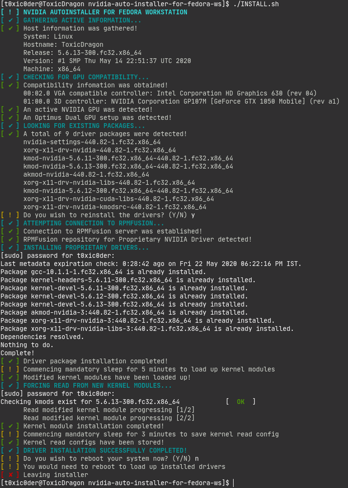

# nvidia-auto-installer-for-fedora-ws
A CLI tool which lets you install proprietary NVIDIA drivers in Fedora WS 32+

The look and feel is heavily inspired from `systemd` and `eopkg` prompts.

## Requirements
* Active internet connection
* Fedora Workstation 32 or above

## Usage
1. Make sure you have active internet connection
2. Download and extract the `NVAutoInstFedoraWS-v0.1.0.tar.gz` from releases
3. Grab a terminal and make that location your working directory
4. Execute `chmod +x INSTALL.sh` and `./INSTALL.sh`
5. Give stars to the repository if you found this helpful

## Note
* Requires secure boot to be turned off in UEFI systems.
* Requires superuser access for repo addition and driver setup.
* Active internet connection is required to download drivers.
* The drivers are fetched from the RPMFusion repository.
* Discrete cards from 9XX/10XX/20XX series only are supported.
* Native support for PRIME configuration is coming soon.
* No additional configuration is required for Optimus setups.
* Consider using executables provided in releases section only.

## Coming soon
* CLI "Launch using Dedicated Graphics Card" option.
* Intuitive mode switching for hybrid graphics.
* Distinct mode for using integrated or discrete GPU.
* Option to install CUDA, NVENC/NVDEC and more.

## Disclaimer
This tool has been tried and tested multiple times and is expected to work flawlessly in Fedora Workstation 32 or above. It has not been tested on any of the spins yet so proceed with caution. While the chances of things going wrong is pretty slim but still you would want to make backups, should things do not go as expected. As always, you are choosing to use this tool at your will and you cannot hold me responsible for any mishap there may occur due to the misuse of this tool.