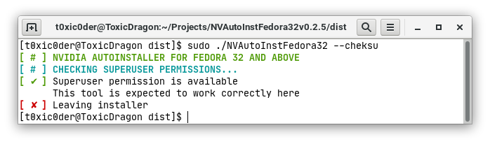
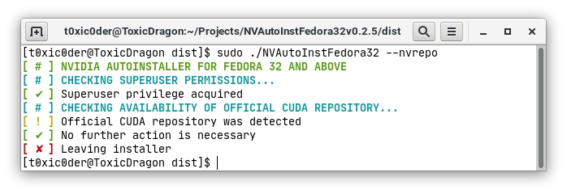
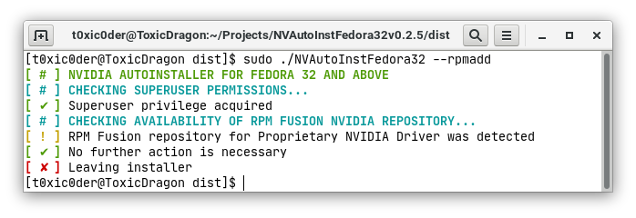
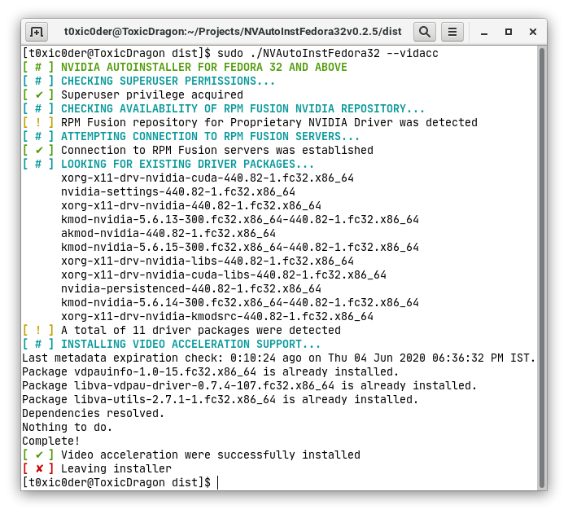
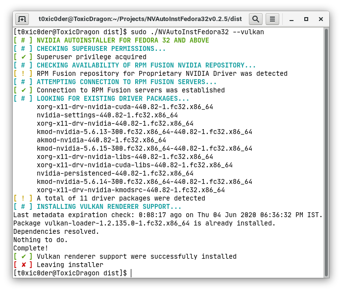
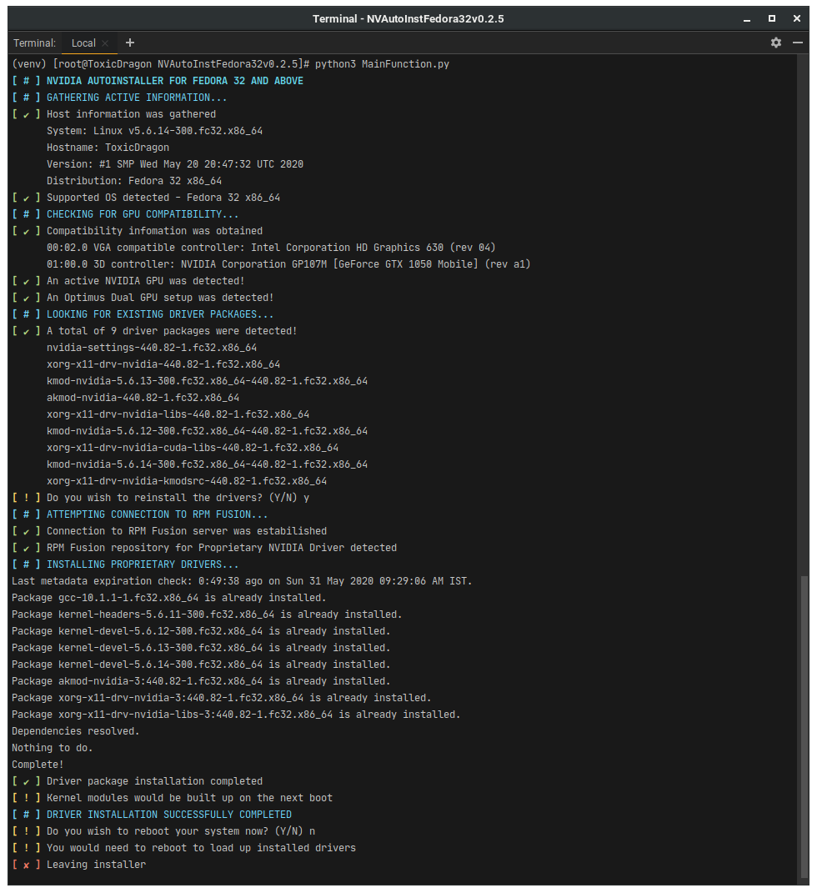
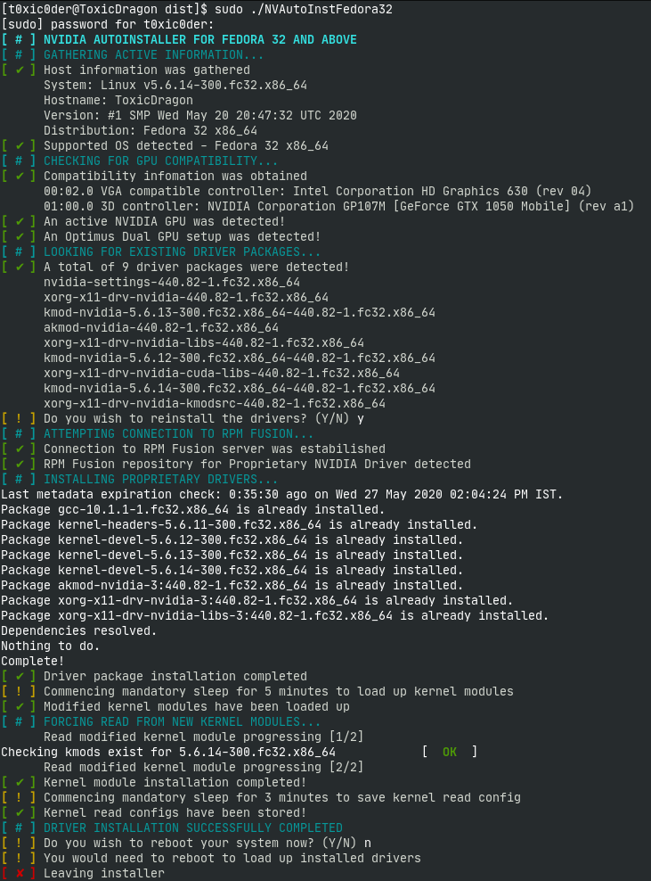

# nvidia-auto-installer-for-fedora
v0.3.0 (04 June 2020)  
A CLI tool which lets you install proprietary NVIDIA drivers and much more easily on Fedora 32 and above

## Screenshots
The look and feel is heavily inspired from `systemd` and `eopkg` prompts.

### v0.3.0

#### Host operating system and hardware compatibility check

#### Current user privilege level check

#### Adding official NVIDIA repo for CUDA support

#### Adding RPM Fusion repository for NVIDIA drivers

#### Installing VDPAU/VAAPI hardware video acceleration

#### Install Vulkan renderer

#### There are tons of more new addition with this update
They could not be listed here with their screenshots as there are too many of them. Feel free to check the releases and try them out.

### v0.2.6
This was a bugfix update targetted to take down a critical bug that prevented users to add the RPM Fusion repository for proprietary NVIDIA drivers. This does not look very different from v0.2.5, hence no screenshot was added for it.

### v0.2.5

### v0.2.0

### v0.1.0
